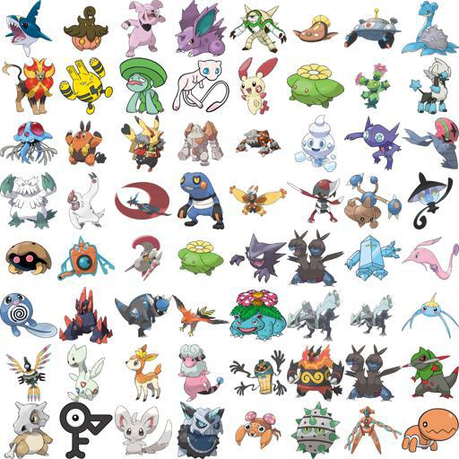
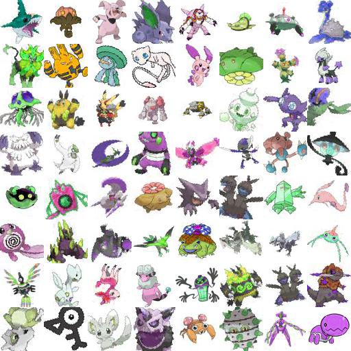
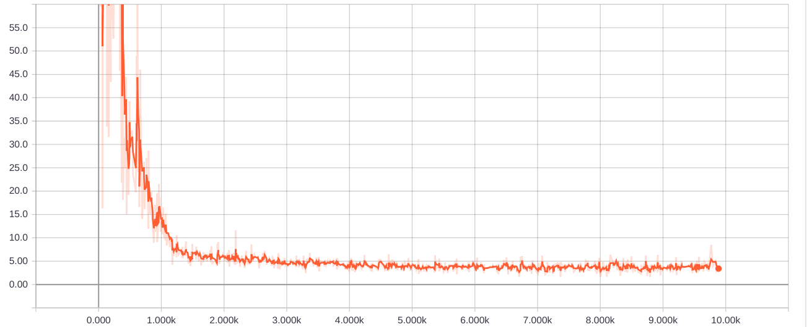
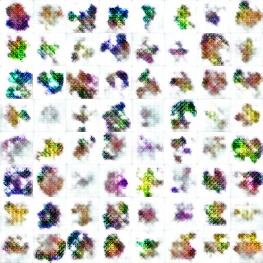
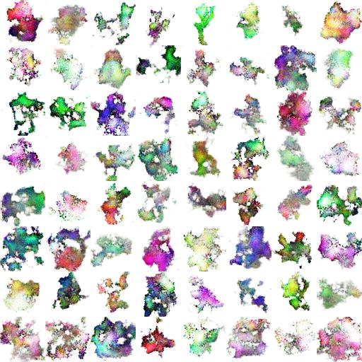
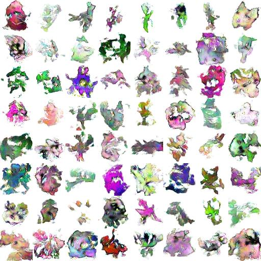
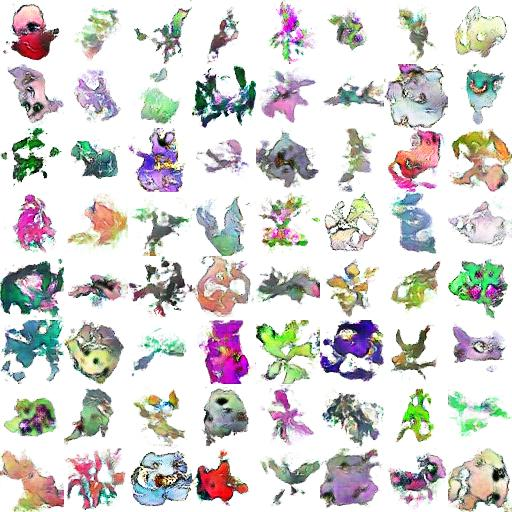

# Pikachiu
Pokemon Generator! Train your own Pokemon Generator using WGAN-GP. The code is
based on [improved_wgan_training](https://github.com/igul222/improved_wgan_training), which
implements the paper [Improved Training of Wasserstein GANs](https://arxiv.org/abs/1704.00028).

## Datasets
Images are collected from Kaggle and Github:

- One-Shot-Pokemon Images: https://www.kaggle.com/aaronyin/oneshotpokemon
- Pokemon Images Dataset: https://www.kaggle.com/kvpratama/pokemon-images-dataset
- Pokemon Images: https://www.kaggle.com/dollarakshay/pokemon-images
- Pokemon_GAN: https://github.com/llSourcell/Pokemon_GAN/tree/master/data

You can use the functions defined in `utils.py` to normalize images.

Some augmentation techniques are also used to enrich the data.
After using augmentation:

## Generator & Discriminator
Both Generator and Discriminator are deep convolutional networks. They are
designed based on the principal of [DCGAN paper](https://arxiv.org/abs/1511.06434) 
with one change. In DCGAN, the weights are initialized from a Normal
distribution with stddev 0.02. However, attempted this in WGAN-GP results in
exploding gradient of the Wasserstein distance and make the model failed
to converge. If we change the initialization to a uniform distribution of
the range `[-0.02*sqrt(3), 0.02*sqrt(3)]` as in [Improved Training of Wasserstein GANs](https://arxiv.org/abs/1704.00028),
the model becomes stable to train. This will need more investigation.

The Wasserstein distance after 10000 iterations:

## Results
Iteration 600:

Iteration 2000:

Iteration 5000:

Iteration 10000:
 